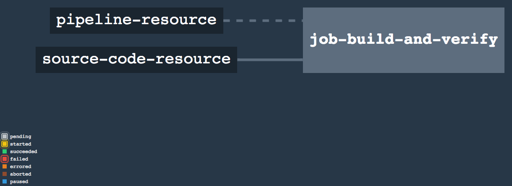

maven-concourse-pipeline
====

The goal of this project is to build a Reference [Concourse](https://concourse.ci) Pipeline for Java applications.

# Credits

https://github.com/starkandwayne/concourse-tutorial.


# Tutorial

We have built a step by step tutorial on how to build a standard Continuous Integration pipeline to build java applications.
We will dedicate a branch to perform each step. This branch, the master, is dedicated to the chapter 00 where we set up Concourse and a git repository for the application we will build using the pipeline.

The current project contains concourse artifacts, i.e. pipeline, tasks and script files. It does not build any specific project.

If you want to follow this tutorial you will need the following directory layout:
```
concourse-tutorial
  |
  └-- maven-concourse-pipeline (clone from https://github.com/MarcialRosales/maven-concourse-pipeline/)
  └-- maven-concourse-pipeline-app1 (clone from your own repository)

```

## 00 - Set up repository for our sample application

1. First create a folder
  ```
  mkdir concourse-tutorial
  cd concourse-tutorial
  ```
2. Checkout master branch of this repository
  ```
  concourse-tutorial$ git clone https://github.com/MarcialRosales/maven-concourse-pipeline
  ```
3. Create a repository or fork https://github.com/MarcialRosales/maven-concourse-pipeline-app1 repo
4. Checkout your repository
  ```
  concourse-tutorial$ git clone https://github.com/<myaccount>/maven-concourse-pipeline-app1
  ```

## 00 - Set up Concourse

**Launch Concourse with Docker-compose**
Access the folder `maven-concourse-pipeline`. From this folder, we are going to launch Concourse using *Docker compose*. This folder has a `docker-compose.yml` file and a `keys` folder with all the required ssh keys.

Make sure you have [Docker](https://docs.docker.com/engine/installation/)
and [Docker compose](https://docs.docker.com/compose/install/) installed.

To launch concourse we run `docker-compose up` which by default reads the file `docker-compose.yml`. On this file we have declared the 3 containers we need to run Concourse: the **database**, the **web-server** which gives us the nice Concourse front-end and the **worker** container where concourse executes the tasks.

**Note: Running via docker-machine** : *If you are running concourse via docker-machine (not natively) make sure you set up the environment variable CONCOURSE_EXTERNAL_URL before running `docker-compose up`*.  
  ```
  CONCOURSE_EXTERNAL_URL=`echo $DOCKER_HOST | sed s/tcp/http/ | sed s/2376/8080/` nohup docker-compose up
  ```

We can open the `CONCOURSE_EXTERNAL_URL` in our browser. The default credentials are concourse:changeme

**Download fly**
Once we have *Concourse* running, we need to download a command line utility called **fly** from the main page of our *Concourse*.

**Login to Concourse**
Before we operate with *Concourse* through *fly* we need to login and remember that login attempt with an alias. Every command we subsequently invoke must refer to that alias.

Let's login to Concourse running under `http://192.168.99.100:8080` using username and password `concourse:changeme` and we give it the alias `plan1`:
```
fly -t plan1 login -c http://192.168.99.100:8080 -u concourse -p changeme
```

It is very likely that *fly* warns us with a message similar to this one:
```
fly version (2.2.1) is out of sync with the target (2.6.0). to sync up, run the following:

    fly -t plan1 sync

cowardly refusing to run due to significant version discrepancy
```

All we have to do is run the suggested command: `fly -t plan1 sync` and it will automatically upgrade our *fly* client.

Now, we are all set to continue.

## Next chapters

### 01 - [Compile & Verify](https://github.com/MarcialRosales/maven-concourse-pipeline/tree/01_build_and_verify)

`concourse-tutorial/maven-course-pipeline$ git checkout origin/01_build_and_verify`



### 02 - [Use corporate Maven Repository](https://github.com/MarcialRosales/maven-concourse-pipeline/tree/02_use_corporate_maven_repo)

`concourse-tutorial/maven-course-pipeline$ git checkout origin/02_use_corporate_maven_repo`

### 03 - [Release Versioned Artifacts](https://github.com/MarcialRosales/maven-concourse-pipeline/tree/03_release_versioned_artifact)

`concourse-tutorial/maven-course-pipeline$ git checkout origin/03_release_versioned_artifact`


### 04 - [Install Built Artifact to Maven Repo](https://github.com/MarcialRosales/maven-concourse-pipeline/tree/04_install_built_artifact)

`concourse-tutorial/maven-course-pipeline$ git checkout origin/04_install_built_artifact`


### 20 - [Deploy, Verify and Promote Release candidate](https://github.com/MarcialRosales/maven-concourse-pipeline/tree/20_deploy_and_verify)

`concourse-tutorial/maven-course-pipeline$ git checkout origin/20_deploy_and_verify`


### 05 - [Feature branches and automatic branch tracking]()

### 30 - [Deploy Surefire Reports](https://github.com/MarcialRosales/maven-concourse-pipeline/tree/30_deploy_surefire_reports)

`concourse-tutorial/maven-course-pipeline$ git checkout origin/30_deploy_surefire_reports`


## Next Installments

### 40 - [Provision services (required by the application)](https://github.com/MarcialRosales/maven-concourse-pipeline/tree/40_provision_infra_with_terraform)

### Push to production if acceptance tests pass


### Provision the PCF runtime where to push our applications
Before we can push our application, we need to provision the necessary infrastructure. We need a PCF foundation identified by an URL, we also need an organization, a space and a user. That space/organization must be configured with certain physical prerequisites like amount of RAM, disk, etc.

This type of provisioning occurs before any application attempts to deploy itself. Furthermore, it is very likely that several applications will be deployed on the same runtime environment. To be more specifics, in terms of PCF, a runtime environment is a space within an organization within a PCF foundation. And we can go even further and assume that we could have many runtime environments for different line of business; we could have all the front-office applications running in one runtime environment and all the back-office apps in separate runtime environment. Some people use the term ecosystem to refer to a runtime environment. Sounds like a good name to me too. To summarize, applications are deployed to ecosystems which must be previously provisioned by someone...
