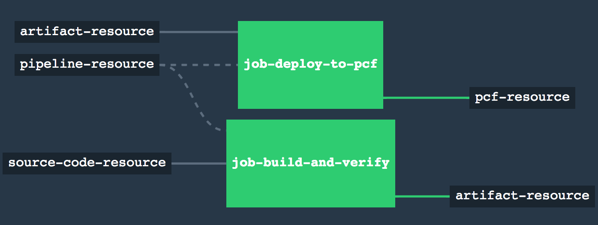

# Deploy Artifact to Pivotal Cloud Foundry

## Purpose

The purpose of this step is to take an artifact from a Maven repository *JFrog* and push it *Cloud Foundry*. This step should trigger as soon as a new version is available.

## Set up
We inherit the set up from the step `02_use_corporate_maven_repo` which gives us *Concourse* and *JFrog*.

If we haven't launched our infrastucture yet, we can do it now:
`nohup docker-compose up & `

However, we need an account in *Cloud Foundry* where to push our application. For this demonstration project, we are going to use *Pivotal Web Service*. If you don't have a *PWS* account go to [https://run.pivotal.io/](https://run.pivotal.io/) and set up a free demo account.

## Pipeline explained

We are going to introduce a new *Concourse* resource called [cf-resource](https://github.com/concourse/cf-resource) to publish our application's artifact (jar) to *Cloud Foundry*.

### Declare pcf-resource as a cf resource
We don't need to declare `cf` as a `resource-type` because it is one of the resource-types that *Concourse* recognizes out of the box. But we still need to declare a `cf` resource and configure it with our *Cloud Foundry* account details.

**Note: We are building the entire pipeline from dev to prod in a single pipeline file. This is not the only way of doing it. You can certainly have one pipeline  for development and a separate one for production**

```
resources:
  ....
- name: pcf-resource
  type: cf
  source:
    api: {{cf-api}}
    username: {{cf-username}}
    password: {{cf-password}}
    organization: {{cf-org}}
    space: {{cf-space}}
    skip_cert_check: false
   ....
```

These are the actual values of those variables in the `credentials.yml`:
```
cf-api: https://api.run.pivotal.io
cf-username: <your username>
cf-password: <your pass>
cf-organization: <your org>
cf-space: <your space>

```

### Add a new job that pushes the built artifact to *Cloud Foundry* as soon as a new version is available

We need to add a new job different to the one we had before that we called `job-build-and-verify`. The purpose of that job was just to build an artifact and to push it to a maven repository if the unit tests passed. Once that artifact is ready in the maven repo, we can trigger other jobs like the one we are about to add. Our job, `job-deploy-to-pcf` will take the latest artifact from the maven repo and push it to the configured *Cloud Foundry* account whose details are in the `credentials.yml`.

```
jobs:
   ...
- name: job-deploy-to-pcf
  plan:
  - get: artifact-resource
    trigger: true
  - get: pipeline-resource
  - task: generate-manifest
    file: pipeline-resource/tasks/generate-manifest.yml
    input_mapping: {pipeline: pipeline-resource, artifact: artifact-resource}
    params:
      APP_NAME: {{cf-app-name}}
      APP_HOST: {{cf-app-host}}
  - put: pcf-resource
    params:
      manifest: manifest/manifest.yml
    ...
```

We have configured this job to trigger as soon as a new artifact becomes available (see the `trigger: true` attribute in the `- get: artifact-resource`). Before we can push the artifact (our jar) we need to generate a `manifest.yml` file and we have created a task for that called `generate-manifest`. It produces a folder called `manifest` which has the `manifest.yml` and the actual artifact. See the 2 parameters we are passing to the task: `APP_NAME` and `APP_HOST`. Our task uses these 2 parameters to produce the corresponding `manifest.yml`.


## Let's run the pipeline

Once again, we are going to set the pipeline from our application's folder (i.e. `maven-concourse-pipeline-app1`).
```
maven-concourse-pipeline-app1$ curl https://raw.githubusercontent.com/MarcialRosales/maven-concourse-pipeline/20_push_to_pcf/pipeline.yml --output pipeline.yml
maven-concourse-pipeline-app1$ fly -t plan1 sp -p push-to-pcf -c pipeline.yml -l credentials.yml
```
This is our pipeline:

